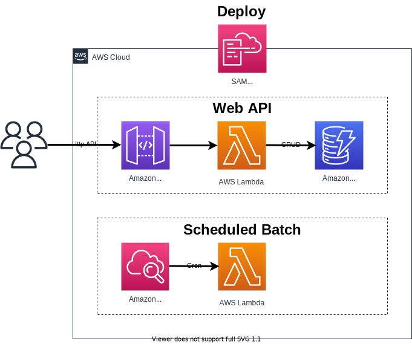

# Template project for AWS Lambda

## 🍀 基本

* AWS Lambda及びAPI Gatewayを使用したサーバレスプロジェクト構成の雛形を提供する
* コスト効率の良いarm64での実装を基本とする
* アプリケーション全体は.NET Coreで構成するが、補助的なLambdaについてはNode.jsを用いる
* ステージング環境、プロダクション環境等の環境に応じた設定が必要な場合は環境変数で指定する形とする
* Lambdaのボイラーテンプレート部分はSource Generatorsを使用して自動生成する
* アプリケーションのデプロイにはCloudFormationを使用する

## ✨ 実装機能

* 自動生成した処理によるDI及びバインディング
* 自動生成した処理によるValidation
* 自動生成した処理による前処理フィルタとしてヘルスチェック機能の実装(暖気運転用)
* カスタムLoggerProviderによるCloudWatch Logsへのフォーマットログ出力
* DynamoDB CRUD
* IServiceCollectionエコシステムを利用した設定による外部Web API呼び出し
* AutoMapperを用いたプレゼンテーションモデルとコアモデルの相互変換
* DynamoDB部分をMoqとするUnitTestサンプル
* CloudWatch Eventsによるバッチ処理の定期実行



## 🔧 ツール

デプロイ用の成果物作成及びデバッグ作業を行うため、以下のコマンドで必要なツールをインストールしておく。

```
dotnet tool update -g amazon.lambda.tools
dotnet tool update -g amazon.lambda.testtool-6.0
```

## 🚀 ビルド

以下のコマンドによりデプロイ用のzipを作成する。
また、CloudFormationのテンプレートとしてserverless.templateも成果物とする。

```
dotnet lambda package Template.Lambda.zip -pl Template.Lambda -c Release -farch arm64
copy /y Template.Lambda\serverless.template Publish\
```

## 📦 デプロイ

コマンドラインでのデプロイは以下のコマンドを成果物のあるディレクトリで実行する。

```
dotnet lambda deploy-serverless --package Template.Lambda.zip
```

## 🔷 アーキテクチャ

本テンプレートのレイヤ構成について記述する。

### 1️⃣ Base

#### ServiceResolver

Lambda関数で使用する各種コンポーネントを定義するDIコンテナを定義する。

#### ApiFilter/EventFilter

API及びCloudWatchイベントのLambda関数に対するフィルタ処理を定義する。

#### ApiMappingProfile

AutoMapperによるマッピングを定義する。

### 2️⃣ Functions

Lambda関数を定義する。  
Lambda関数はSource Generatorsによりボイラーテンプレート部分が自動生成されるため、serverless.templateでの定義は以下のように変更する。

* Before

```yaml
"CrudGet": {
  "Type": "AWS::Serverless::Function",
  "Properties": {
    "Handler": "Template.Lambda::Template.Lambda.Functions.CrudFunction::Get",
...
```

* After

```yaml
"CrudGet": {
  "Type": "AWS::Serverless::Function",
  "Properties": {
    "Handler": "Template.Lambda::Template.Lambda.Functions.CrudFunction_Get::Handle",
...
```

### 3️⃣ Parameters

HTTP APIのLambda関数で使用するRequest/Responseの構造を定義する。  
DataAnnotationsの属性を指定することで[FromBody]で取得する入力に対するバリデーションが実行される。

### 4️⃣ Services

アプリケーションサービス層を定義する。

### 5️⃣ Models

DynamoDB等のデータ構造を定義する。  
Lambda関数のResponseとしてModels層のデータを直接返す事は良いが、Requestとしての直接使用は禁止する。  
Requestについては必要な項目のみに制限してバリデーション用の属性を付加したプレゼンテーション用のモデルを作成し、Modelsのデータ構造とは相互にマッピングして使用する。  
また、Responseについても返す項目を制限する必要がある場合には同様の形とする。

### 6️⃣ Components

ログ、データアクセスといった処理に対するプロバイダーやシリアライザー等の各種コンポーネントを定義する。

## 🚧 次に行う事

* SNS/SQSのをイベントトリガーとする処理
* RDS Proxyを使用したRDB操作
* Cognito連携による認証処理
* Kinesis連携によるストリーム分析
